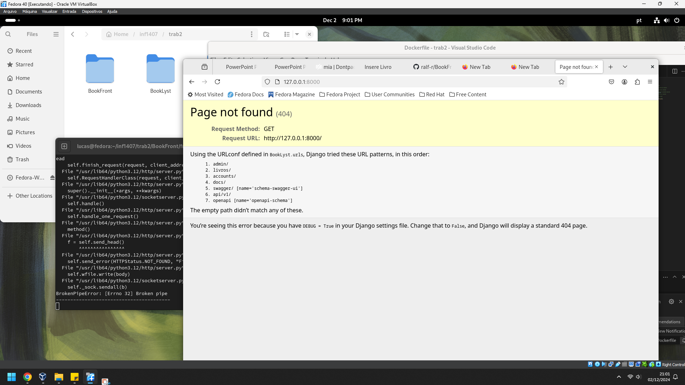
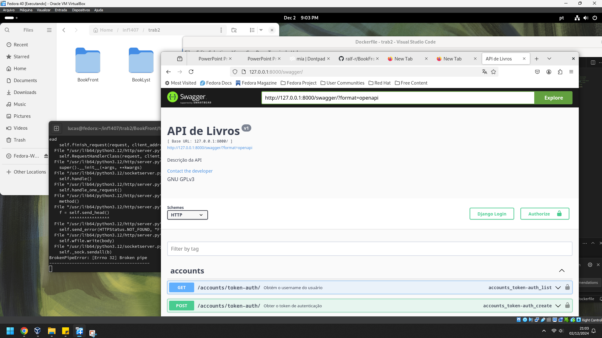

# INF1407(PROG WEB)  BackEnd do projeto Booklyst !
Esse é o repositório principal.
A explicação sobre o **backend**. Lembre de ligar as 2 imagens docker e se for verificar o swagger pelo menos 1 a imagem docker do backend.

---
## Backend
repositorio (esse, na branch novo)
imagem(https://hub.docker.com/repository/docker/miyaaaa/backend/general)

Necessário alterar do modo DEBUG para tirar o swagger. Isto é, no settings.py, mude de False para True.
Instalação:
  docker pull miyaaaa/backend
  docker run -d -p 8000:8000 miyaaaa/backend

O projeto não segue completamente as especificações do pré-projeto, mas implementa algumas funcionalidades dele.
Avaliação de acordo com o pré projeto:
- O usuário não pode criar listas de livros sem estar logado: Usuários não logados podem adicionar, editar ou excluir livros da lista.
Embora tenha login de usuário, o site funciona como uma lista compartilhada de livros onde usuários podem cadastrar, editar ou excluir livros da lista.

- O usuário poderá se cadastrar e alterar: Cadastro funcionando, alteração de senha apresenta problemas

- Ao fazer login, ele terá acesso a uma lista de livros: Ao acessar a aplicação já terá acesso a lista.

- O administrador cadastra os livros na lista e cada usuário poderá criar suas proproias listas personalizadas utilizando livros dessa lista: Não há permições exclusivas do administrador.

Cada usuário poderá criar,editar, ou excluir suas próprias listas personalizadas: Não há lista personalizada, a lista é compartilhada.

Não funciona:
  Scripts do swagger ausentes.
  Troca de senha apresenta problemas
  Recuperação de Senha não implementado.

  
  
  
